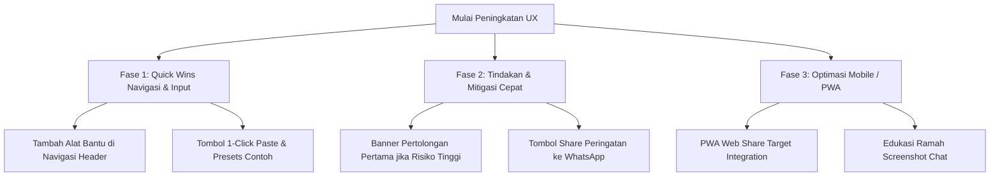

# Rekomendasi Pembaruan Alur Kerja & Efisiensi Pengguna (Workflow Improvements)

Dokumen ini merangkum evaluasi alur kerja (*user journey & workflow*) aplikasi **JagaWarga** serta daftar rekomendasi pembaruan agar platform lebih mudah, intuitif, dan efektif digunakan oleh masyarakat awam.

---

## 1. Latar Belakang & Filosofi UX

Prinsip utama JagaWarga adalah:
> **Cek → Pahami → Bertindak → Belajar**

Sebagian besar pengguna target adalah warga umum (non-teknis) yang sedang menghadapi situasi mencurigakan (misalnya: pesan WhatsApp berhadiah, tautan phishing, APK undangan palsu, atau bahkan sedang panik karena merasa data pribadinya bocor). Desain alur kerja harus mengutamakan **kejelasan bahasa manusia, kecepatan akses, dan tindakan mitigasi langsung**.

---

## 2. Analisis Titik Friksi (*Friction Points*) & Rekomendasi Solusi

### A. Alur Pemasukan Data (*Intake Flow*)

| Titik Friksi Saat Ini | Dampak pada Pengguna | Solusi / Pembaruan Rekomendasi |
| :--- | :--- | :--- |
| **Ambiguitas Unggah Gambar (File vs Screenshot vs QR)** | Warga sering mengunggah *screenshot* pesan chat. Saat ini gambar non-QR hanya di-hash SHA-256 (bukan dibaca teksnya), membuat warga salah paham mengira isi percakapan sudah dianalisis. | Tampilkan deteksi dan panduan ramah: jika file adalah gambar non-QR, beri catatan *"Gambar ini bukan kode QR. Jika ini tangkapan layar pesan penipuan, silakan salin teksnya ke kolom pemeriksaan."* |
| **Label Teknis pada Form Input** | Label bertuliskan *"URL, DOMAIN, IP, HASH, PESAN, ATAU HEADER EMAIL"*. Warga awam bingung dengan istilah *Hash*, *IP Publik*, atau *Header Email*. | Sediakan penanda visual/tab sederhana di atas kotak input: `[ 🔗 Tautan Web ]` `[ 💬 Teks Pesan ]` `[ 📄 Berkas/APK ]` `[ 📷 Kode QR ]`. |
| **Ketiadaan Tombol Tempel Instan (*1-Click Paste*)** | Pengguna ponsel harus menekan lama (*long-press*) lalu memilih *Paste*, yang sering kurang responsif di peramban HP. | Tambahkan tombol **📋 Tempel dari Clipboard** yang memanfaatkan `navigator.clipboard.readText()`. |
| **Tidak Ada Contoh Sampel Pengujian** | Pengguna baru tidak tahu format apa yang valid dan ragu mencoba. | Sediakan tombol kecil contoh: *"Coba contoh tautan mencurigakan"* atau *"Coba contoh pesan phishing"*. |

---

### B. Alur Hasil & Pemahaman (*Result & Action Flow*)

| Titik Friksi Saat Ini | Dampak pada Pengguna | Solusi / Pembaruan Rekomendasi |
| :--- | :--- | :--- |
| **Skor Angka Membingungkan** | Skor numerik (misal `75/100 risiko`) menimbulkan keraguan: apakah 75% kemungkinan bahaya atau tingkat keparahan? | Pertahankan visual lampu lalu lintas yang tegas dengan bahasa sehari-hari: **Merah (Bahaya: Jangan Dibuka)**, **Kuning (Waspada: Verifikasi Ulang)**, **Hijau (Belum Ada Indikasi)**, **Abu-abu (Data Kurang)**. |
| **Keterputusan dengan Alur Darurat (*Emergency Flow*)** | Saat hasil deteksi menunjukkan **Risiko Tinggi** atau **Phishing**, pengguna yang sudah terlanjur mengklik tautan tersebut bingung harus melakukan apa. Tombol darurat hanya ada di navbar atas. | Sertakan *First Aid Callout* langsung di halaman hasil: **⚠️ Sudah terlanjur klik atau transfer uang?** dengan tombol satu-klik menuju panduan langkah darurat (`/emergency`). |
| **Ketiadaan Fitur Berbagi Peringatan** | Budaya masyarakat Indonesia saling mengingatkan di grup WhatsApp keluarga atau RT belum difasilitasi langsung dari aplikasi. | Tambahkan tombol **📲 Bagikan Peringatan ke WhatsApp** yang otomatis memformat teks peringatan ramah warga: *"Peringatan JagaWarga: Tautan [domain] terdeteksi berisiko penipuan. Jangan buka atau isi data."* |

---

### C. Aksesibilitas Fitur & Navigasi (*Discoverability*)

| Titik Friksi Saat Ini | Dampak pada Pengguna | Solusi / Pembaruan Rekomendasi |
| :--- | :--- | :--- |
| **Menu `/tools` Tersembunyi** | Fitur khusus seperti analisis header email, generator hash lokal, dan decoder QR berada di `/tools`, namun tautan navigasi utama di header tidak mencantumkannya. | Tambahkan menu navigasi **Alat Bantu (`/tools`)** pada `SiteHeader`. |
| **Pemisahan Halaman Detail yang Kaku** | Alur dari beranda (`/`) → hasil (`/result`) → detail teknis (`/details`) membutuhkan banyak perpindahan halaman bagi pengguna mahir/operator. | Sediakan *accordion* ringkas di halaman hasil untuk melihat statistik mesin keamanan secara instan tanpa wajib membuka halaman terpisah. |

---

### D. Pengalaman Mobile & PWA

| Titik Friksi Saat Ini | Dampak pada Pengguna | Solusi / Pembaruan Rekomendasi |
| :--- | :--- | :--- |
| **Harus Buka Aplikasi Manual dari Chat** | Pengguna menerima pesan mencurigakan di WhatsApp/Telegram, harus menyalin, membuka browser, lalu menempelkan tautan. | Aktifkan `share_target` pada `manifest.ts` PWA agar pengguna Android/iOS dapat langsung menekan tombol *Share/Bagikan* dari aplikasi chat langsung ke JagaWarga. |

---

## 3. Matriks Rencana Implementasi

### Prioritas Pelaksanaan

1. **Prioritas 1 (Quick Wins - Dampak Segera):**
   - Menambahkan tautan **Alat Bantu** ke header navigasi (`app/site-header.tsx`).
   - Menyediakan tombol **Tempel Cepat** & **Contoh Tautan** di halaman utama (`app/page.tsx`).
2. **Prioritas 2 (High Impact - Keselamatan Pengguna):**
   - Menautkan hasil risiko tinggi langsung ke langkah mitigasi darurat (`app/result/page.tsx` → `/emergency`).
   - Fitur salin ringkasan peringatan untuk dibagikan ke keluarga/komunitas.
3. **Prioritas 3 (Mobile & Ecosystem Integration):**
   - PWA Web Share Target (`app/manifest.ts`).
   - Edukasi deteksi gambar tangkapan layar (*screenshot handling*).
